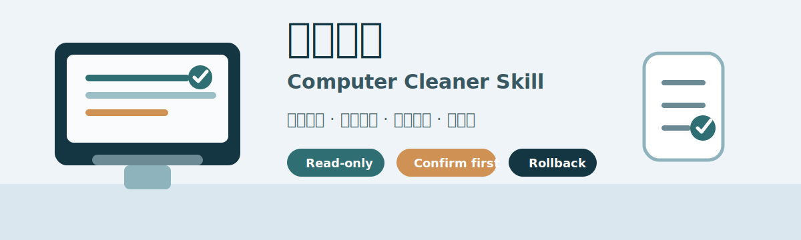

# 电脑清理 / Computer Cleaner Skill

[](https://github.com/86Kolton/computer-cleaner-skill/actions/workflows/validate.yml)



一个面向 Codex 的安全电脑清理 skill。它默认只做本地只读扫描，生成分级清理、迁移和复扫方案；任何删除、移动、改配置动作都必须逐项确认，并优先保留回滚路径。

## 适用场景

- C 盘或磁盘空间不足，需要先找出主要占用。
- 整理下载、桌面、文档、图片等用户目录。
- 查找大文件、旧文件、同大小候选和精确重复文件。
- 分析 npm、pnpm、yarn、pip、Cargo、Maven、Gradle、NuGet 等开发缓存。
- 评估 Docker、WSL、浏览器缓存、Windows 更新缓存等高风险占用。

## 安全原则

- 默认不删除、不移动、不改配置。
- 默认不上传文件内容、文件名清单、截图或目录树到远程服务。
- 默认跳过系统目录、`.git`、`node_modules` 等高风险或重型目录，并在报告中列明。
- 高风险目录默认只列存在状态；需要测量时必须显式加 `--measure-high-risk-known`。
- 删除类动作优先使用回收站或非 C 盘隔离区，并写 manifest/undo 信息。

## 安装

使用 Codex 的 skill installer 从 GitHub 安装：

```powershell
python "$env:USERPROFILE\.codex\skills\.system\skill-installer\scripts\install-skill-from-github.py" `
  --repo 86Kolton/computer-cleaner-skill `
  --path skills/qing-li-dian-nao
```

安装后重启 Codex，让新 skill 生效。之后可以用 `/清理电脑`、`清理电脑`、`C盘爆了`、`找重复文件` 等表达触发。

## 直接运行扫描器

扫描器是标准库 Python 脚本，不依赖第三方包：

```powershell
$env:PYTHONUTF8 = "1"
python ".\skills\qing-li-dian-nao\scripts\cleanup_scan.py" `
  --root "D:\Downloads" `
  --output "D:\cleanup-reports"
```

常用参数：

- `--include-common`：扫描当前用户常见目录。
- `--include-known`：分析已知缓存和系统相关位置。
- `--include-dev-heavy`：包含 `.git` 和 `node_modules`。
- `--hash-duplicates`：对同大小文件做 SHA-256 精确查重。
- `--measure-high-risk-known`：测量高风险已知目录，默认不建议开启。
- `--max-files`：限制单次扫描文件数，避免误扫过大范围。

## 仓库结构

```text
skills/qing-li-dian-nao/
  SKILL.md
  agents/openai.yaml
  scripts/cleanup_scan.py
  references/research-synthesis.md
tests/
  verify_skill.py
.github/workflows/
  validate.yml
```

## 验证

本地运行：

```powershell
python .\tests\verify_skill.py
python -m py_compile .\skills\qing-li-dian-nao\scripts\cleanup_scan.py
```

测试覆盖 skill 元数据、只读安全静态扫描、脚本编译、帮助参数、重复文件检测、默认跳过目录、开发重型目录开关、最大文件限制和缺失路径告警。

## 许可证

MIT
